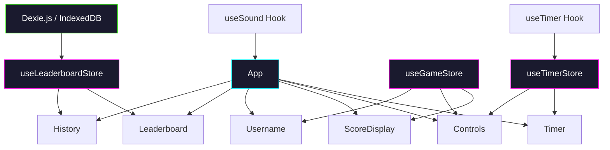

# Stop the Clock!

A precision timing game built with React 18. Stop the clock **exactly** when the centiseconds hit `:00` to score a point and keep your streak alive. Miss by even one centisecond and your streak resets.

> Can you chain 10 perfect stops in a row?

---

## How to Play

1. **Enter a username** (optional but required to submit scores)
2. Press **Start** to begin the timer
3. Press **Stop** when the centiseconds display reads **00**
4. If you nail it, press **Chain** to keep going and build your streak
5. Miss? Your streak is saved. Press **Reset** and try again
6. **Submit** your score to the leaderboard when you're ready

**Tip:** The timer uses `requestAnimationFrame` + `performance.now()` for sub-millisecond precision. No cheating with slow intervals!

---

## Features

- **Precision Timer** - `requestAnimationFrame` + `performance.now()` for rock-solid centisecond accuracy
- **Dark Cyber/Neon Theme** - Glowing timer, neon accent colors, subtle ambient lighting
- **Persistent Storage** - Scores survive refresh, browser close, and multiple sessions (IndexedDB via Dexie.js)
- **Global Leaderboard** - Top 50 scores, sorted and animated
- **Personal History** - Last 10 attempts with timestamps
- **Sound Effects** - Oscillator-based success/fail/new-best chimes
- **Confetti** - Particle explosions on new personal bests
- **Responsive** - Fully playable on mobile and desktop
- **Smooth Animations** - Framer Motion throughout

---

## Architecture



### State Management (Zustand)

| Store | Purpose |
|---|---|
| `useTimerStore` | Timer elapsed time, running state, phase (idle/running/success/fail) |
| `useGameStore` | Username, score, personal best, last result |
| `useLeaderboardStore` | Leaderboard data, personal history, DB operations |

### Persistence (Dexie.js / IndexedDB)

| Table | Description |
|---|---|
| `highScores` | Per-user high scores |
| `attempts` | Last 10 attempts per user with timestamps |
| `leaderboard` | Global top 50 scores (unique per username) |

---

## Tech Stack

| Layer | Technology |
|---|---|
| Framework | React 18 |
| Styling | Tailwind CSS 3 |
| State | Zustand |
| Persistence | Dexie.js (IndexedDB) |
| Animation | Framer Motion |
| Icons | Lucide React |
| Effects | Canvas Confetti, Web Audio API |
| Build | Create React App |

---

## Getting Started

### Prerequisites

- Node.js 16+
- npm 8+

### Installation

```bash
git clone <repo-url>
cd js-react
npm install
```

### Development

```bash
npm start
```

Open [http://localhost:3000](http://localhost:3000) in your browser.

### Build

```bash
npm run build
```

### Tests

```bash
CI=true npm test
```

---

## Project Structure

```
src/
  db/
    database.js         # Dexie.js database schema and queries
  stores/
    useTimerStore.js    # Timer state (Zustand)
    useGameStore.js     # Game state (Zustand)
    useLeaderboardStore.js  # Leaderboard + history (Zustand)
  hooks/
    useTimer.js         # requestAnimationFrame timer loop
    useSound.js         # Web Audio API sound effects
  utils/
    formatTime.js       # Time formatting utilities
  components/
    App/App.js          # Main layout and game orchestration
    Timer/Timer.js      # Large animated timer display
    Controls/Controls.js    # Start / Stop / Chain / Submit / Reset
    ScoreDisplay/ScoreDisplay.js  # Current streak + personal best
    Username/Username.js    # Login/logout input
    Leaderboard/Leaderboard.js  # Top 50 global scores
    History/History.js      # Recent personal attempts
```

---

## Future Ideas

- Multiplayer mode via WebRTC or WebSocket
- Difficulty levels (stop on :50, :25, etc.)
- Achievement badges
- Custom themes selector
- PWA offline support
- Server-synced leaderboard

---

## What's New (v2.0)

- Complete rewrite from class-based to modern functional React 18
- Replaced `setInterval` with `requestAnimationFrame` + `performance.now()`
- Fixed all mutable state bugs (direct array/object mutations)
- Added Zustand for clean state management (3 stores)
- Added Dexie.js persistence (IndexedDB) - scores survive refresh
- Dark neon/cyber UI theme with Tailwind CSS
- Framer Motion animations throughout
- Sound effects (Web Audio oscillator)
- Confetti on new personal bests
- Leaderboard (top 50) + personal history (last 10)
- Fully responsive layout (mobile + desktop)
- Cleaned up component hierarchy - no more prop drilling
