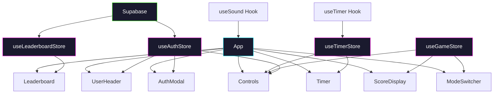

# Stop the Clock!

A precision timing game built with React 18 + Supabase. Stop the clock **exactly** when the centiseconds hit `:00` to score a point and keep your streak alive. Miss by even one centisecond and your streak resets.

> Can you chain 10 perfect stops in a row?

---

## How to Play

1. **Sign in** with email/password to save scores, or play as a **guest** (scores won't be submitted)
2. **Pick a mode** — Classic or Weenie Hut Junior
3. Press **Start** to begin the timer
4. Press **Stop** when the centiseconds display reads **00** (or within ±0.05s in Weenie mode)
5. If you nail it, press **Chain** to keep going and build your streak
6. Miss? Your streak is saved. Press **Reset** and try again
7. **Submit** your score to the global leaderboard when you're ready

**Tip:** The timer uses `requestAnimationFrame` + `performance.now()` for sub-millisecond precision. No cheating with slow intervals!

---

## Game Modes

| Mode | Rule | Vibe |
|---|---|---|
| **Classic** | Must stop exactly on `:00` — zero tolerance | Neon cyan, hardcore |
| **Weenie Hut Junior** | ±0.05s forgiveness (centiseconds 0–5 or 95–99) | SpongeBob yellow/orange, extra confetti 🧽 |

Each mode has its own **separate global leaderboard** and **per-user high score tracking**.

---

## Multiplayer / Competing with Friends

1. Share this app's URL with friends
2. Each player creates an account (email + password)
3. Pick the same mode and try to out-streak each other
4. Check the **Leaderboard** tabs to see who's on top
5. Both Classic and Weenie Hut Junior have independent rankings

---

## Features

- **Supabase Auth** — Email/password sign-up and login, guest mode for casual play
- **Global Leaderboards** — Two separate tabs: Classic Legends & Weenie Hut Juniors (top 50 each)
- **Per-User Scores** — High score and best streak saved per mode, persisted forever in Supabase
- **Two Game Modes** — Classic (exact) and Weenie Hut Junior (±0.05s forgiveness)
- **Precision Timer** — `requestAnimationFrame` + `performance.now()` for rock-solid centisecond accuracy
- **Dark Cyber/Neon Theme** — Glowing timer, neon accent colors, subtle ambient lighting
- **Weenie Theme** — SpongeBob-style yellow/orange accents, extra confetti, fun badge on timer
- **Sound Effects** — Oscillator-based success/fail/new-best chimes
- **Confetti** — Particle explosions on new personal bests (extra in Weenie mode!)
- **Responsive** — Fully playable on mobile and desktop
- **Smooth Animations** — Framer Motion throughout

---

## Architecture



### State Management (Zustand)

| Store | Purpose |
|---|---|
| `useTimerStore` | Timer elapsed time, running state, phase (idle/running/success/fail) |
| `useGameStore` | Game mode, score, personal best, last result |
| `useLeaderboardStore` | Classic + Weenie leaderboards, Supabase score operations |
| `useAuthStore` | Supabase auth state, user profile, sign-in/sign-up/sign-out |

### Persistence (Supabase)

| Table | Description |
|---|---|
| `scores` | Per-user high score + best streak per mode (classic/weenie) |
| `profiles` | Display names for leaderboard |

---

## Tech Stack

| Layer | Technology |
|---|---|
| Framework | React 18 |
| Backend | Supabase (Auth + Postgres) |
| Styling | Tailwind CSS 3 |
| State | Zustand |
| Animation | Framer Motion |
| Icons | Lucide React |
| Effects | Canvas Confetti, Web Audio API |
| Build | Create React App |

---

## Getting Started

### Prerequisites

- Node.js 16+
- npm 8+
- A Supabase project (see [SQL Migration](#sql-migration) below)

### Installation

```bash
git clone <repo-url>
cd js-react
npm install
```

### Environment Variables

Create a `.env` file in the project root:

```
REACT_APP_SUPABASE_URL=https://your-project.supabase.co
REACT_APP_SUPABASE_ANON_KEY=your-anon-key
```

### SQL Migration

Run this SQL in your Supabase SQL Editor to create the required tables:

```sql
-- See the SQL migration section at the bottom of this README
```

### Development

```bash
npm start
```

Open [http://localhost:3000](http://localhost:3000) in your browser.

### Build

```bash
npm run build
```

### Tests

```bash
CI=true npm test
```

---

## Project Structure

```
src/
  lib/
    supabaseClient.js       # Supabase client initialization
  stores/
    useTimerStore.js         # Timer state (Zustand)
    useGameStore.js          # Game state + mode (Zustand)
    useLeaderboardStore.js   # Leaderboard + Supabase ops (Zustand)
    useAuthStore.js          # Auth state (Zustand + Supabase Auth)
  hooks/
    useTimer.js              # requestAnimationFrame timer loop
    useSound.js              # Web Audio API sound effects
  utils/
    formatTime.js            # Time formatting + success check with mode tolerance
  components/
    App/App.js               # Main layout and game orchestration
    Timer/Timer.js           # Large animated timer display + Weenie badge
    Controls/Controls.js     # Start / Stop / Chain / Submit / Reset
    ScoreDisplay/ScoreDisplay.js  # Current streak + personal best
    ModeSwitcher/ModeSwitcher.js  # Classic / Weenie Hut Jr mode toggle
    UserHeader/UserHeader.js     # Sign in / sign out / guest display
    AuthModal/AuthModal.js       # Email/password auth dialog
    Leaderboard/Leaderboard.js   # Two-tab global leaderboard
```
